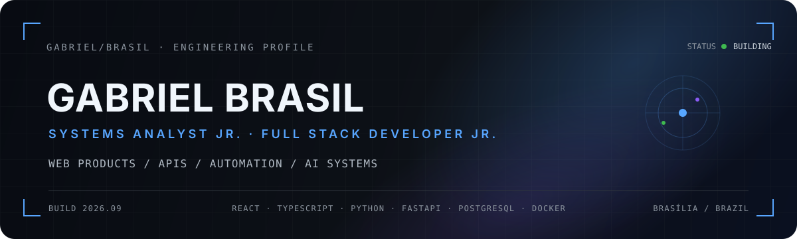

<table>
<tr>
<td width="28%" valign="top" align="center">

<h2>Gabriel Brasil</h2>

<strong>Junior Full Stack Developer</strong>

  

Brasília, DF · Brazil 
Systems Analysis & Development · UDF 
React · TypeScript · Python · FastAPI

  

<a href="https://www.linkedin.com/in/gabrielbrasildev">LinkedIn</a> ·
<a href="https://portfolio-gabriel-brasil.pages.dev/">Portfolio</a> 
<a href="mailto:g4brielbr4sil@gmail.com">Email</a> ·
<a href="https://github.com/g4brielbr4sil">GitHub</a>

  

</td>
<td width="72%" valign="top">

 

### About me

I build **web products, internal systems and automation** that solve real operational problems. My work combines systems analysis, frontend and backend development, APIs, integrations, testing, deployment and continuous improvement.

My main stack is **React, TypeScript, Python, FastAPI, PostgreSQL, Supabase and Docker**. I also work with cloud infrastructure, workflow automation and AI-assisted systems.

</td>
</tr>
</table>

## Featured projects

<table>
<tr>
<td width="50%" valign="top">

### Hermes
**Agent infrastructure & operational automation**

Full-stack system originally built as a personal command center for CRM, finance, tasks, studies, reports and automation. Its current architecture is evolving toward autonomous agents, events, tools, memory, permissions, approvals and auditable execution.

`Python` `FastAPI` `React` `TypeScript` `SQLite` `Docker` `AI Agents`

<a href="https://portfolio-gabriel-brasil.pages.dev/projetos/hermes-command-center/"><strong>View case study →</strong></a>

</td>
<td width="50%" valign="top">

### PNQC
**Professional education platform**

Training and certification platform built and deployed with authentication, account recovery, student/agency/admin roles, protected routes, RLS policies, courses, modules, lessons, assessments, sequential progression, performance tracking and verifiable certificates.

`React` `TypeScript` `Vite` `Supabase` `PostgreSQL` `Cloudflare Pages`

<a href="https://levens-qualifica-pnqc.pages.dev/"><strong>Open application →</strong></a> · <a href="https://portfolio-gabriel-brasil.pages.dev/projetos/pnqc/"><strong>Case study</strong></a>

</td>
</tr>
<tr>
<td width="50%" valign="top">

### Barthy Web Studio
**Digital products, systems & automation**

Author-led studio and product laboratory for small businesses, combining web presence, product thinking, internal systems, commercial organization, automation and integrations.

`React` `TypeScript` `Vite` `Tailwind CSS` `Cloudflare Pages`

<a href="https://github.com/g4brielbr4sil/barthy-web-studio-v2"><strong>Repository →</strong></a> · <a href="https://portfolio-gabriel-brasil.pages.dev/projetos/barthy-web-studio-v2/"><strong>Case study</strong></a>

</td>
<td width="50%" valign="top">

### Portfolio
**Engineering cases & delivery evidence**

Public portfolio focused on real responsibilities, technical decisions, architecture, case studies and evidence of delivery instead of a generic project gallery.

`React` `TypeScript` `Vite` `Tailwind CSS` `Motion` `Cloudflare Pages`

<a href="https://portfolio-gabriel-brasil.pages.dev/"><strong>Live →</strong></a> · <a href="https://github.com/g4brielbr4sil/portfolio-gabriel-brasil"><strong>Source</strong></a>

</td>
</tr>
<tr>
<td colspan="2" valign="top">

### RadarDF
**Employment intelligence product · in development**

Product focused on multichannel job ingestion, structured résumés, matching, antifraud and candidate/company workflows for the Federal District employment market.

`Product Architecture` `Data` `Automation` `AI`

</td>
</tr>
</table>

## Tech stack

  

<table>
<tr><td><strong>Frontend</strong></td><td>React · TypeScript · JavaScript · Vite · Tailwind CSS · Figma</td></tr>
<tr><td><strong>Backend</strong></td><td>Python · FastAPI · REST APIs · SQLAlchemy</td></tr>
<tr><td><strong>Data</strong></td><td>PostgreSQL · SQLite · Supabase · Row Level Security</td></tr>
<tr><td><strong>Infrastructure</strong></td><td>Docker · Linux/Ubuntu · AWS Lightsail · Cloudflare Pages · Hostinger · SSL · reverse proxy</td></tr>
<tr><td><strong>Engineering</strong></td><td>Git · GitHub · branches · pull requests · CI/CD · functional testing · debugging · homologation · technical documentation</td></tr>
<tr><td><strong>Automation & integrations</strong></td><td>n8n · Bitrix24 · Iugu · ZapSign · Resend · WhatsApp · forms · authentication · payments · notifications</td></tr>
<tr><td><strong>AI</strong></td><td>LLMs · prompt engineering · AI agents · tool calling · workflow automation · AI governance</td></tr>
</table>

## GitHub activity

  
  

  

  

## Experience & education

<table>
<tr>
<td width="55%" valign="top">

### Levens
**Junior Developer · Systems, Web & Automation**  
**Jun 2025 – Aug 2026 · Brasília, DF**

Worked across systems analysis, web development, automation, technical support and continuous improvement.

- Built and deployed PNQC with React, TypeScript, Vite, Supabase and Cloudflare Pages.
- Designed interfaces and user journeys in Figma.
- Implemented authentication, account recovery, role-based access, protected routes and RLS policies.
- Modeled business rules, relationships, functions, indexes, permissions and sensitive-data protection in Supabase/PostgreSQL.
- Investigated bugs, executed functional tests, homologated fixes and followed production incidents.
- Worked with integrations including n8n, Bitrix24, Iugu, ZapSign, Resend and WhatsApp.
- Connected operational needs, users and management to technical requirements and digital solutions.

</td>
<td width="45%" valign="top">

### UDF Centro Universitário
**Technology Degree · Systems Analysis and Development**  
**2022 – 2027**

Academic focus on software development, databases, software engineering, requirements analysis, application architecture and technology project management.

 

### Acclivity
**Game Development Intern**  
**Jan 2023 – Jun 2023 · Hybrid · Brasília**

Participated in the early stage of a gamer-focused platform, collaborating on screen organization, interface prototyping, navigation flows and product functionality discussions.

</td>
</tr>
</table>

## Certifications

<table>
<tr>
<td width="50%" valign="top">

**Mestre em Engenharia de Prompt e Colaboração com IA**  
Cruzeiro do Sul · Aug 2026 · [Verify credential](https://www3.cruzeirodosulvirtual.com.br/badges/exibir/21186462-904d-4f54-8d4a-2a994a8382cc)

</td>
<td width="50%" valign="top">

**Arquiteto de IA e Responsabilidade Digital**  
Cruzeiro do Sul · Aug 2026 · [Verify credential](https://www3.cruzeirodosulvirtual.com.br/badges/exibir/aa1253e1-4ded-4c99-9ec9-492bb6cd337d)

</td>
</tr>
<tr>
<td width="50%" valign="top">

**English for IT B2 / GSE 59–75**  
[View certifications on LinkedIn](https://www.linkedin.com/in/gabrielbrasildev/details/certifications/)

</td>
<td width="50%" valign="top">

**English for IT 1**  
[View certifications on LinkedIn](https://www.linkedin.com/in/gabrielbrasildev/details/certifications/)

</td>
</tr>
</table>

**Languages:** Portuguese · Native/Bilingual | English · Professional Working

## AI governance & research

### Ethical Analysis of AI in Automated Recruitment

Academic case study on AI in recruitment, centered on Amazon's experimental recruiting system. The work addresses algorithmic bias, fairness, transparency, social impact, data protection, LGPD, governance and human oversight, with practical recommendations for responsible AI use in selection processes.

`Artificial Intelligence` `Technology Ethics` `Documentation` `LGPD` `AI Governance` `Human Oversight`

## Contact

  
  
  
  

Code is more than logic. It is how I turn real problems into working systems.

