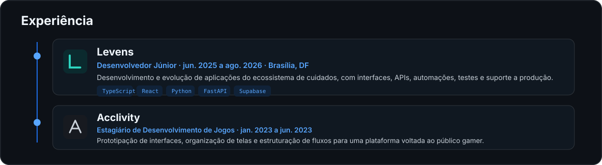
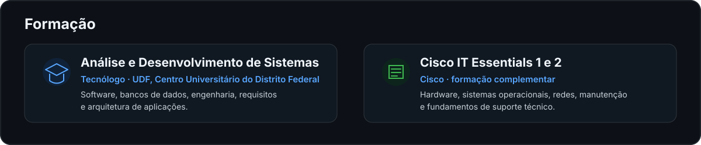

  

  
  
  
  
  

  

  

  
  
  
  
  
  

## Tecnologias

  

  
  
  
  
  

## Atividade no GitHub

  
  

  

  

  

  

  

  
  
  

## Contato

  
  
  

Construo software para transformar problemas reais em soluções que funcionam de verdade.

